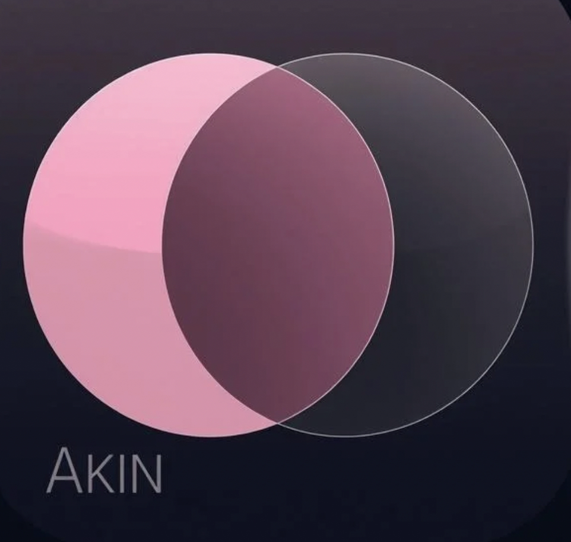

<div align="center">



# Akin

**The mutual matching app for your class.**
Find your people — privately, beautifully.

[](https://nextjs.org)
[](https://firebase.google.com)
[](https://typescriptlang.org)
[](https://framer.com/motion)

</div>

---

## What is Akin?

Akin is a **privacy-first mutual matching platform** built for school classes. Students browse their classmates anonymously — no one knows you liked them unless they like you back. When two people mutually pick each other as their **Akin**, it's a match.

No public feeds. No follower counts. Just genuine, mutual connection.

---

## Features

- **Intro slides** — Smooth onboarding explaining the mechanic before signup
- **Google & Email auth** — Firebase Authentication, no anonymous sessions
- **School hierarchy** — Schools → Classes → Students
- **One-pick Akin mechanic** — Pick one classmate every 48 hours as your Akin
- **Mutual match reveal** — Cinematic shatter-and-bloom animation when two people match
- **Privacy Mode** — One tap hides all names and avatars behind a minimal off-white UI
- **Gradient avatars** — 12 unique gradient identities, no photos required
- **Real-time matches** — Firestore subscriptions, updates live without refresh

---

## Stack

| Layer | Tech |
|---|---|
| Framework | Next.js 14 (App Router) |
| Language | TypeScript |
| UI | Tailwind CSS v4 + custom CSS variables |
| Animations | Framer Motion v11 |
| Auth | Firebase Authentication |
| Database | Cloud Firestore |
| Hosting | Render |

---

## Project Structure

```
akin/
├── app/
│   ├── page.tsx              # Root routing (intro → auth → onboarding → class)
│   ├── auth/page.tsx         # Sign in / Sign up
│   ├── onboarding/page.tsx   # Name + gradient avatar picker
│   ├── setup/page.tsx        # School + class selection
│   ├── class/[classId]/      # Main browse + matches page
│   └── globals.css           # Design system (glass, orchid, mint)
├── components/
│   ├── IntroSlides.tsx        # 3-screen animated onboarding
│   ├── AuthForm.tsx           # Login / signup form
│   ├── CardStack.tsx          # Swipeable classmate cards
│   ├── AkinSlot.tsx           # Your current Akin pick + cooldown timer
│   ├── MatchReveal.tsx        # Match celebration overlay
│   ├── MatchesList.tsx        # Your mutual connections list
│   ├── GradientAvatar.tsx     # Gradient circle with initials
│   ├── Navigation.tsx         # Bottom tab bar
│   └── SchoolSetup.tsx        # School/class browser + creator
├── providers/
│   ├── UserProvider.tsx       # Auth state + profile + Akin pick
│   └── PrivacyModeProvider.tsx
├── lib/
│   ├── firebase.ts            # Firebase app init
│   └── firestore.ts           # All DB queries + type definitions
└── public/
    └── akin-logo.png
```

---

## Design Language

Akin uses a **Frosted Privacy** aesthetic:

- **Dark mode** — `#07070f` deep background with layered glass surfaces
- **Orchid** `#9b6dff` — primary accent, Akin picks, active states
- **Mint** `#00e5a0` — matches, confirmations, success
- **Rose** `#ff4f7b` — hearts, passion, like actions
- **Backdrop blur** — `backdrop-filter: blur(20px)` on all cards and overlays
- **Privacy Mode** — switches everything to a clean off-white minimalist layout

---

## How It Works

```
1. Browse your classmates as cards
2. Pick one as your Akin (locked for 48 hours)
3. They don't know — unless they pick you back
4. Mutual pick = match reveal animation
5. Your connections live in the Matches tab
```

The mechanic is intentionally limited. One pick. 48 hours. It forces you to be deliberate.

---

## Getting Started

```bash
# Install dependencies
npm install

# Run dev server
npm run dev

# Build for production
npm run build
npm start
```

> Firebase is pre-configured in `lib/firebase.ts`. No environment variables needed.

---

## Deployment

Akin is deployed on [Render](https://render.com).

| Setting | Value |
|---|---|
| Build Command | `npm install && npm run build` |
| Start Command | `npm start` |
| Node Version | 18+ |

After deploying, add your Render URL to **Firebase Console → Authentication → Authorized Domains** so Google Sign-In works in production.

---

<div align="center">

Made with care. Built for connection.

</div>
